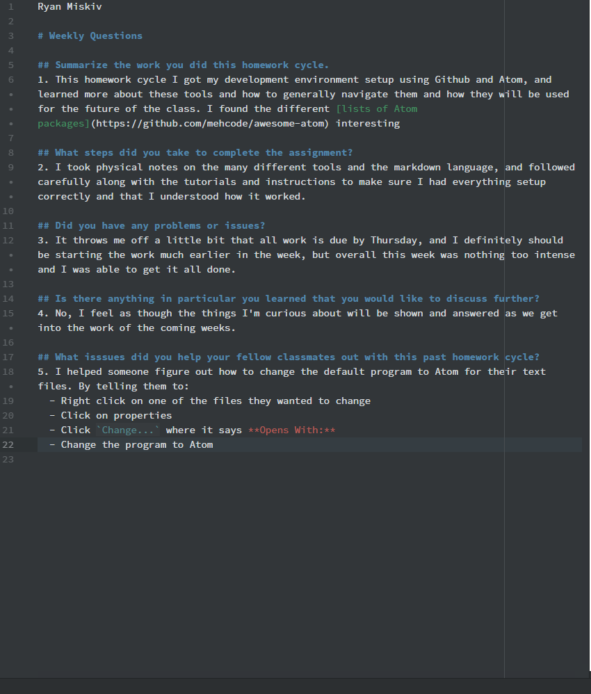

Ryan Miskiv

# Weekly Questions

## Summarize the work you did this homework cycle.
1. This homework cycle I got my development environment setup using Github and Atom, and learned more about these tools and how to generally navigate them and how they will be used for the future of the class. I found the different [lists of Atom packages](https://github.com/mehcode/awesome-atom) interesting

## What steps did you take to complete the assignment?
2. I took physical notes on the many different tools and the markdown language, and followed carefully along with the tutorials and instructions to make sure I had everything setup correctly and that I understood how it worked.

## Did you have any problems or issues?
3. It throws me off a little bit that all work is due by Thursday, and I definitely should be starting the work much earlier in the week, but overall this week was nothing too intense and I was able to get it all done.

## Is there anything in particular you learned that you would like to discuss further?
4. No, I feel as though the things I'm curious about will be shown and answered as we get into the work of the coming weeks.

## What isssues did you help your fellow classmates out with this past homework cycle?
5. I helped someone figure out how to change the default program to Atom for their text files. By telling them to:
  - Right click on one of the files they wanted to change
  - Click on properties
  - Click `Change...` where it says **Opens With:**
  - Change the program to Atom

Here is the Image of my editor 
